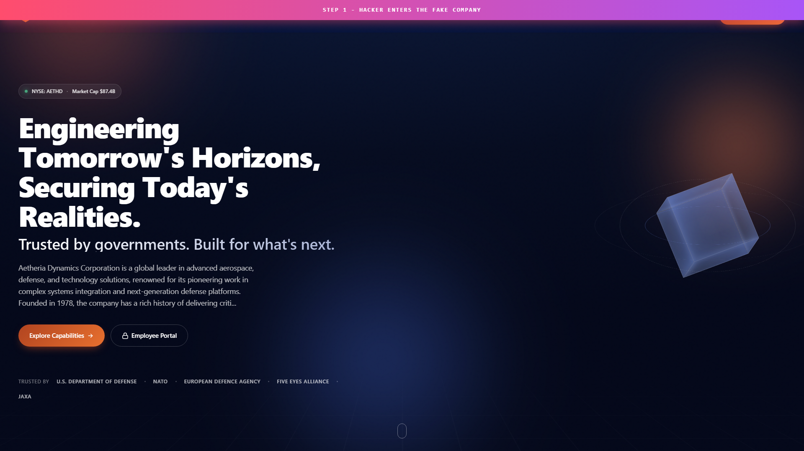
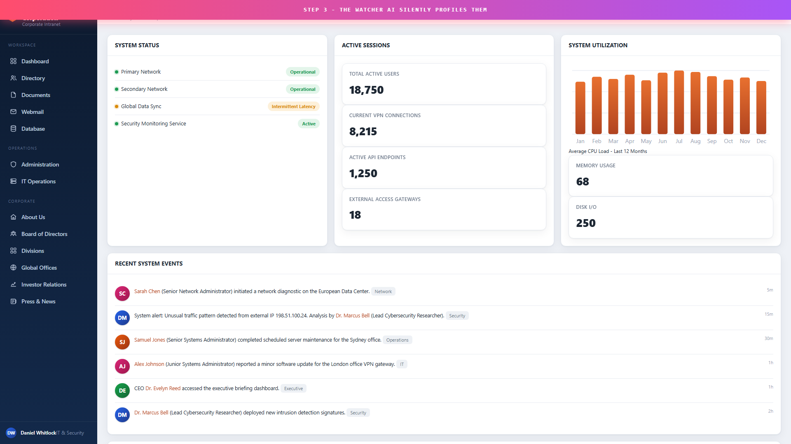
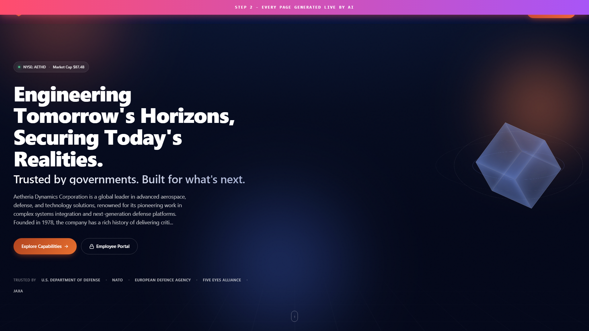

# MIRAX

### AI-Powered Deception Honeypot

> *A perfect illusion: looks 100% real, is 100% fake.*

-orange?style=flat-square)

---

> ## 🔒 Source code is private
>
> Recruiters / hiring managers: request read-only access by reaching out directly — temporary GitHub collaborator access will be granted for the duration of our conversation.

---

## What is MIRAX

MIRAX is an advanced **deception honeypot**. When an intruder breaks in, they don't find a static decoy — they find an **entire fake company**, generated and endlessly expanded by AI in real time. Fake employees, fake documents, fake emails, fake databases, fake credentials. Every layer they break opens another. There is no bottom and no edge.

While the intruder is lost inside the illusion, a second AI silently watches — fingerprinting them, logging every move, mapping their behaviour to the **MITRE ATT&CK** framework, and building a complete attacker profile.

This is the offensive side of cybersecurity: not defence, but deception.

## Demo — see MIRAX trap a hacker live (Full HD)

(After Danish drag-drops the asset, the URL goes here.)

## The two AIs

| AI | Role |
|----|------|
| **The Illusionist** | Builds and endlessly expands the fake world. Every path an intruder visits becomes a convincing page, generated on demand and cached for consistency. |
| **The Watcher** | Silently records every action, fingerprints the attacker, scores the threat, maps TTPs to MITRE ATT&CK, and generates an intelligence profile. |

## Key features

- 🏢 **Infinite fake company** — coherent employees, documents, projects, mail, databases. Every internal link leads deeper.
- 🧠 **Real-time AI generation** — the Illusionist conjures any requested page; an unmapped path is never a dead end.
- 🎣 **Canary tokens** — planted fake secrets. If an intruder ever *reuses* one, MIRAX knows they took the bait.
- 🛰️ **MITRE ATT&CK mapping** — every request is scored against real technique IDs (T1595, T1190, T1110, T1083, T1059, T1552...).
- 🔍 **Attacker fingerprinting** — stable per-intruder dossiers across many requests.
- 📊 **Watcher console** — a live SOC-style dashboard: sessions, techniques, captured credentials, bait hits, AI profiles.
- 🔌 **Runs with or without an API key** — full AI illusion with a free Gemini key; a complete template fallback without one.

## Why this exists

Most companies discover they were hacked weeks after the fact. MIRAX flips the script: the hacker gets stuck wasting time in an endless illusion while their tools, behaviour, and intent are silently catalogued. The defender gets a clean attacker dossier instead of a breach.

## Inside the Watcher dashboard

## Inside the illusion

## Inspired by — and going beyond

Deception tech is a real, respected field (Thinkst Canary, CounterCraft, Acalvio). MIRAX's novel twist is the **AI-generated infinite company** and the **dedicated profiling AI** — there is no static template at any layer; everything is a live AI synthesis.

## Contact

For source-code access or to discuss MIRAX, reach out via my GitHub profile.

## Licence

(c) 2026 Danish · All rights reserved. Proprietary.
